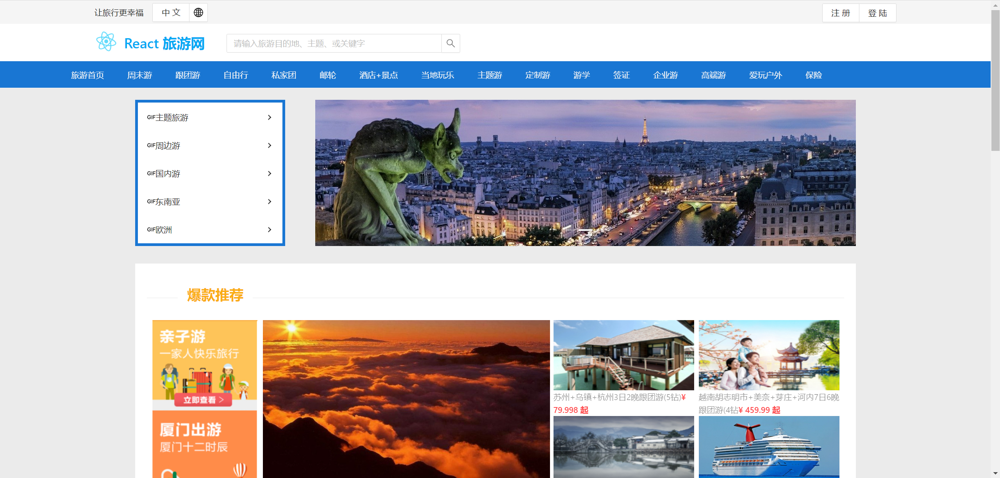
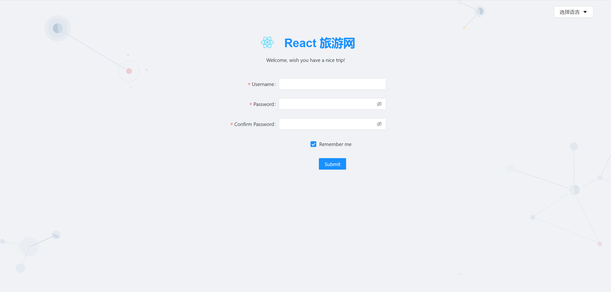
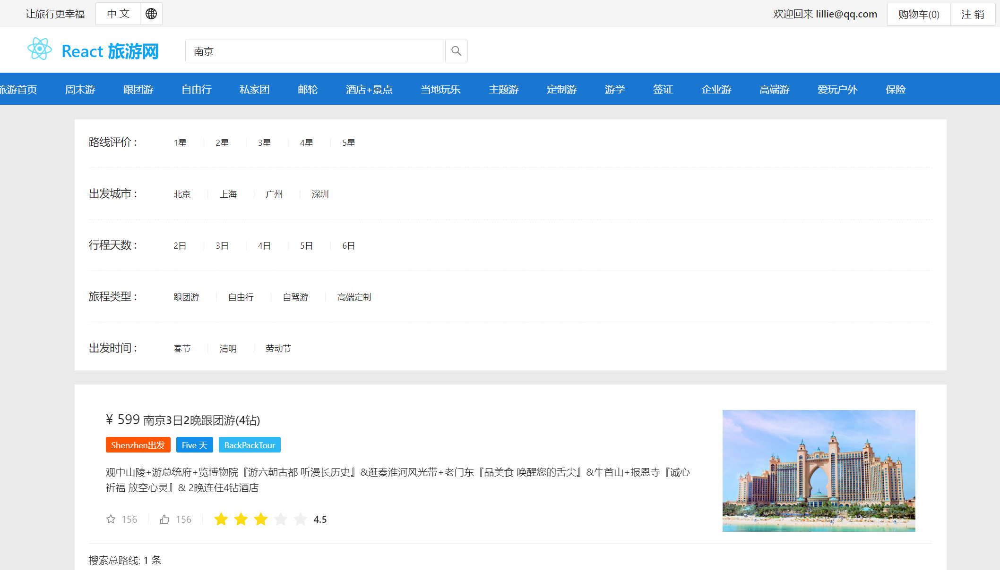
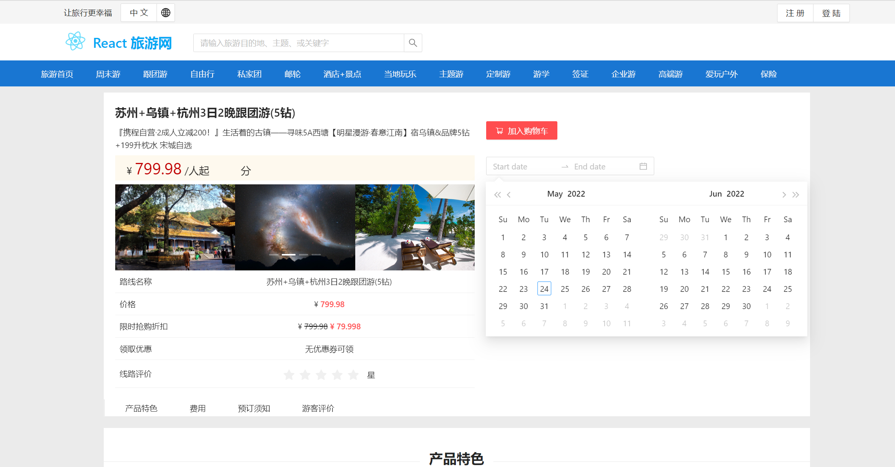
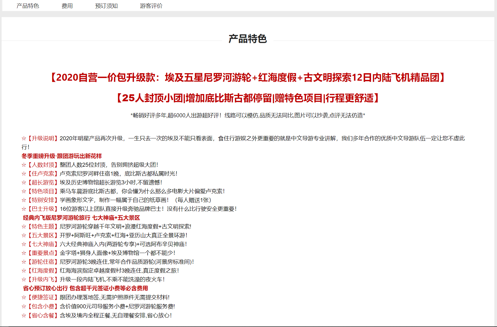
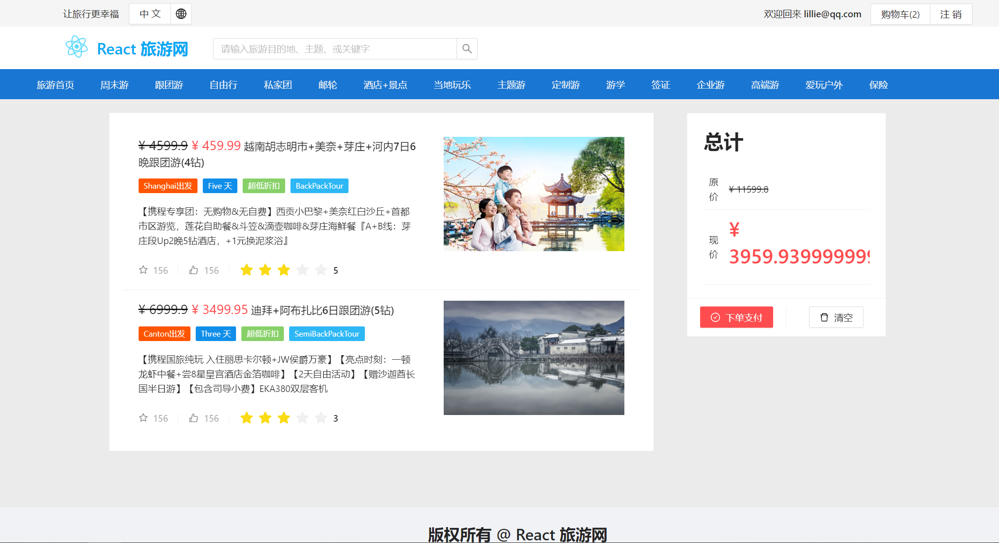
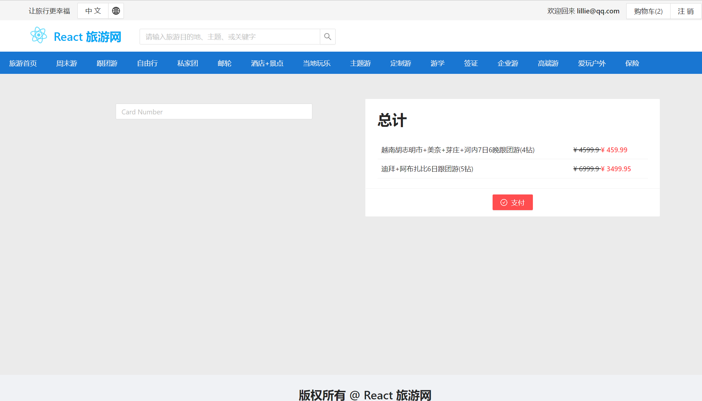

# 基于React的旅游网

## 项目介绍

是一个仿携程网的的前端项目，基于React+Redux+Antd+TS实现。主要包括旅游首页、登录注销、旅游商品详情页、加入购物车、订单支付等功能。
技术栈：React+Redux+React-Router+Antd+Axios+TypeScript.

### 项目演示

首页

注册页面

用户搜索页面

商品详情页

购物车页面

支付页面

